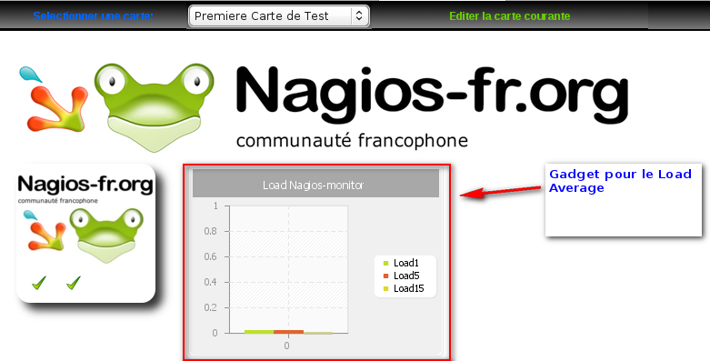

addons:addons:nagvis:nagvis-gadget\_pgraphload\_rendu.png
=========================================================

nagvis-gadget\_pgraphload\_rendu.png

← Retour à [Customization de
NagVis](../../../../nagios/addons/nagvis/customisation-nagvis.html "nagios:addons:nagvis:customisation-nagvis")

Date:
:   2013/03/29 09:42
Nom de fichier:
:   nagvis-gadget\_pgraphload\_rendu.png
Format:
:   PNG
Taille:
:   85KB
Largeur:
:   781
Hauteur:
:   397

