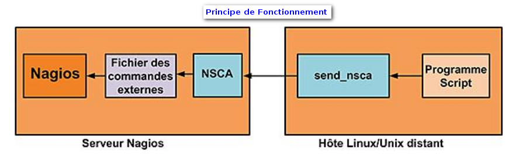

addons:addons:nsca\_principe.png
================================

nsca\_principe.png

← Retour à [Protocole
NSCA](../../../nagios/addons/nsca.html "nagios:addons:nsca")

Date:
:   2013/03/29 09:42
Nom de fichier:
:   nsca\_principe.png
Format:
:   PNG
Taille:
:   141KB
Largeur:
:   888
Hauteur:
:   264

