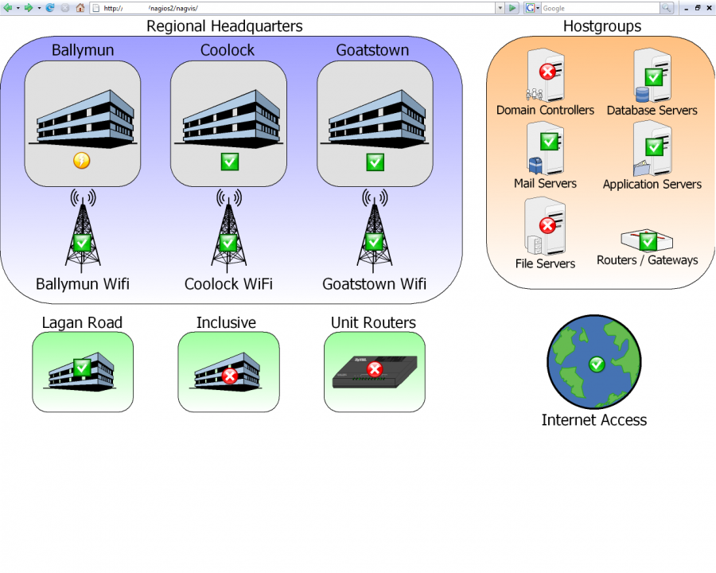

addons:nagvis:exemple1.png
==========================

exemple1.png

← Retour à [Manuel d'utilisation de
NagVis](../../../nagios/addons/nagvis/nagvis-manuel-utilisation.html "nagios:addons:nagvis:nagvis-manuel-utilisation")

Date:
:   2013/03/29 09:42
Nom de fichier:
:   exemple1.png
Format:
:   PNG
Taille:
:   131KB
Largeur:
:   1280
Hauteur:
:   1024

