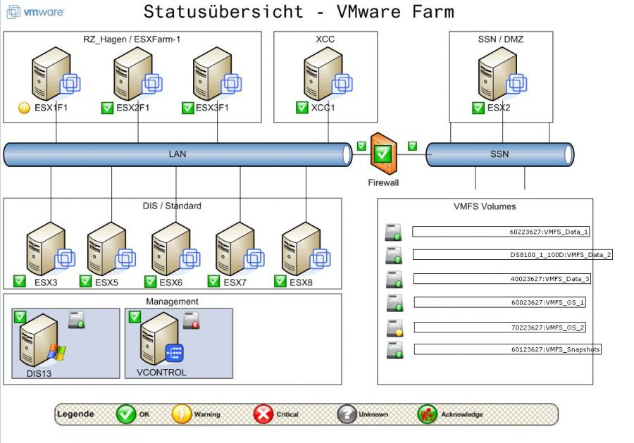

addons:nagvis:nagvis\_vmware.jpg
================================

nagvis\_vmware.jpg

← Retour à [Manuel d'utilisation de
NagVis](../../../nagios/addons/nagvis/nagvis-manuel-utilisation.html "nagios:addons:nagvis:nagvis-manuel-utilisation")

Date:
:   2013/03/29 09:42
Nom de fichier:
:   nagvis\_vmware.jpg
Format:
:   JPEG
Taille:
:   308KB
Largeur:
:   1133
Hauteur:
:   792

