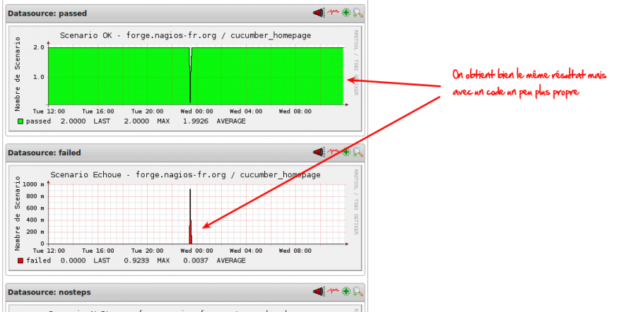

addons:pnp:pnp\_template\_cucumber\_optimise.png
================================================

pnp\_template\_cucumber\_optimise.png

← Retour à [Création de modèles de graphiques pour PNP
0.6](../../../nagios/addons/pnp/creation-template-graph.html "nagios:addons:pnp:creation-template-graph")

Date:
:   2013/03/29 09:42
Nom de fichier:
:   pnp\_template\_cucumber\_optimise.png
Format:
:   PNG
Taille:
:   67KB
Largeur:
:   1073
Hauteur:
:   527

