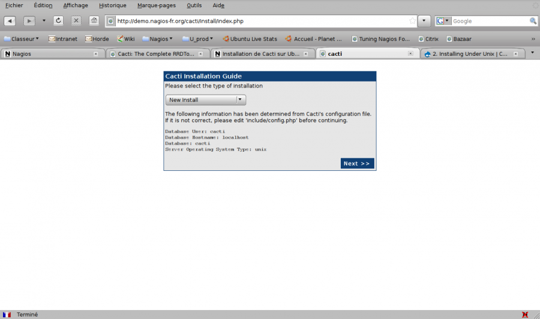

cacti:cacti-install2.png
========================

cacti-install2.png

← Retour à [Installation de Cacti sur
Ubuntu](../../cacti/ubuntu-install.html "cacti:ubuntu-install")

Date:
:   2013/03/29 09:42
Nom de fichier:
:   cacti-install2.png
Format:
:   PNG
Taille:
:   67KB
Largeur:
:   1268
Hauteur:
:   750

