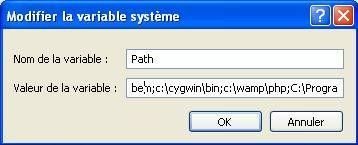

cacti:cygwin-path.jpg
=====================

cygwin-path.jpg

← Retour à [Installation de Cacti
Windows](../../cacti/windows-install.html "cacti:windows-install")

Date:
:   2013/03/29 09:42
Nom de fichier:
:   cygwin-path.jpg
Format:
:   JPEG
Taille:
:   13KB
Largeur:
:   358
Hauteur:
:   145

