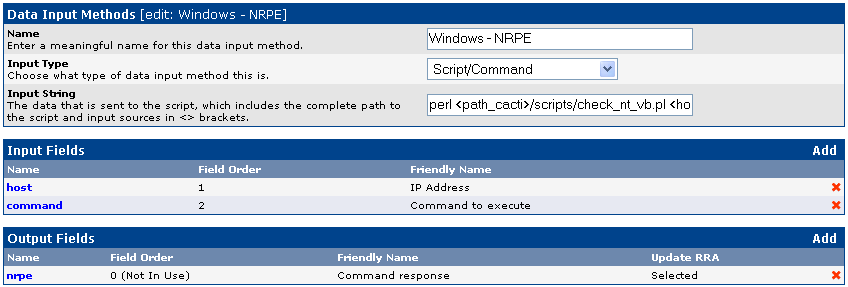

cacti:data\_input.png
=====================

data\_input.png

← Retour à [Configuration de
Cacti](../../cacti/configuration.html "cacti:configuration")

Date:
:   2013/03/29 09:42
Nom de fichier:
:   data\_input.png
Format:
:   PNG
Taille:
:   9KB
Largeur:
:   848
Hauteur:
:   287

