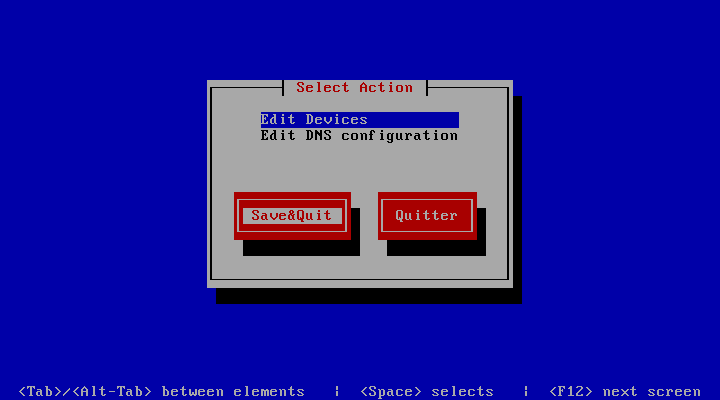

centreon:ces:centreon-enterprise-server-en-fonction-oracle-vm-virtualbox\_019.png
=================================================================================

centreon-enterprise-server-en-fonction-oracle-vm-virtualbox\_019.png

← Retour à [Installation de Centreon Enterprise
Server](../../../centreon/centreon-enterprise-server.html "centreon:centreon-enterprise-server")

Date:
:   2013/03/29 09:42
Nom de fichier:
:   centreon-enterprise-server-en-fonction-oracle-vm-virtualbox\_019.png
Format:
:   PNG
Taille:
:   4KB
Largeur:
:   720
Hauteur:
:   400

