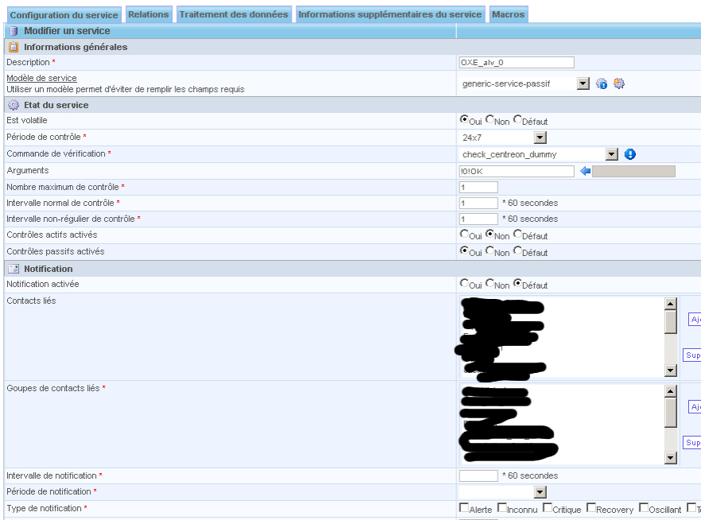

centreon:screenshot194.png
==========================

screenshot194.png

← Retour à [Superviser un Autocom OXE V9.x Alcatel-Lucent sous
Centreon/Nagios](../../centreon/superviser-oxe-alcatel.html "centreon:superviser-oxe-alcatel")

Date:
:   2013/03/29 09:42
Nom de fichier:
:   screenshot194.png
Format:
:   PNG
Taille:
:   31KB
Largeur:
:   882
Hauteur:
:   654

