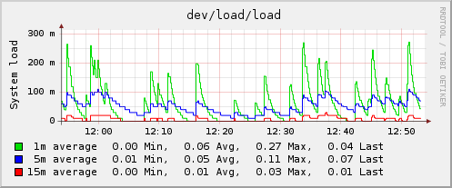

collectd-load.png
=================

collectd-load.png

← Retour à
[Collectd](../nagios/integration/collectd.html "nagios:integration:collectd")

Date:
:   2013/03/29 09:42
Nom de fichier:
:   collectd-load.png
Format:
:   PNG
Taille:
:   19KB
Largeur:
:   497
Hauteur:
:   207

