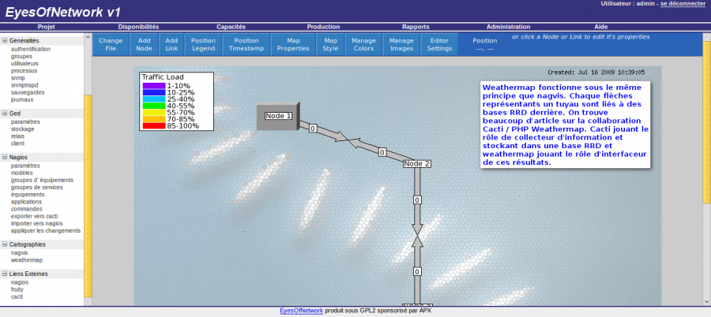

eon-admin\_weathermap.png
=========================

eon-admin\_weathermap.png

← Retour à [Interface Web de
EyesOfNetwork](../eyesofnetwork/eyesofnetwork-interface.html "eyesofnetwork:eyesofnetwork-interface")

Date:
:   2013/03/29 09:42
Nom de fichier:
:   eon-admin\_weathermap.png
Format:
:   PNG
Taille:
:   429KB
Largeur:
:   1280
Hauteur:
:   573

