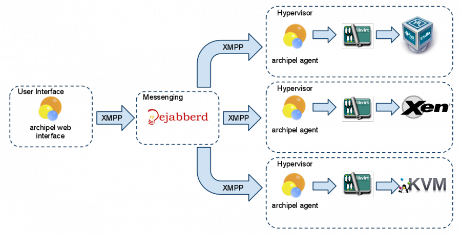

infra:archipel:archipel-overview.png
====================================

archipel-overview.png

← Retour à [Installation de archipel sous ubuntu
10.10](../../../infra/archipel.html "infra:archipel")

Date:
:   2013/03/29 09:42
Nom de fichier:
:   archipel-overview.png
Format:
:   PNG
Taille:
:   116KB
Largeur:
:   1164
Hauteur:
:   593

