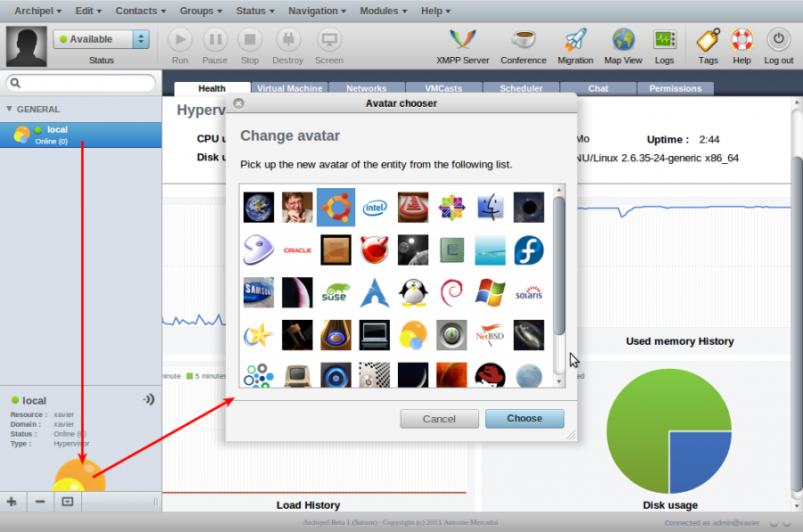

infra:archipel:avatars.png
==========================

avatars.png

← Retour à [Installation de archipel sous ubuntu
10.10](../../../infra/archipel.html "infra:archipel")

Date:
:   2013/03/29 09:42
Nom de fichier:
:   avatars.png
Format:
:   PNG
Taille:
:   199KB
Largeur:
:   999
Hauteur:
:   663

