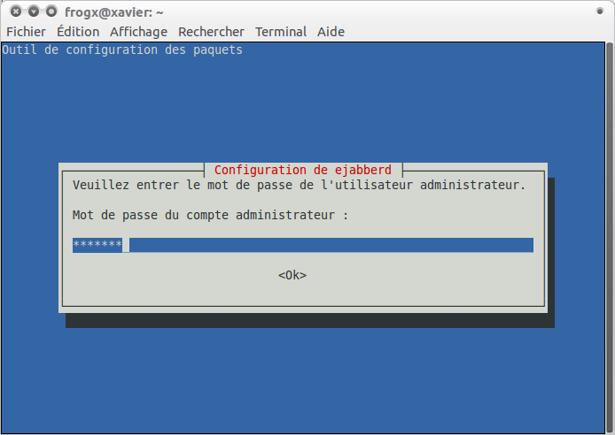

infra:archipel:ejabberd:003.png
===============================

003.png

← Retour à [Installation de archipel sous ubuntu
10.10](../../../../infra/archipel.html "infra:archipel")

Date:
:   2013/03/29 09:42
Nom de fichier:
:   003.png
Format:
:   PNG
Taille:
:   21KB
Largeur:
:   694
Hauteur:
:   492

