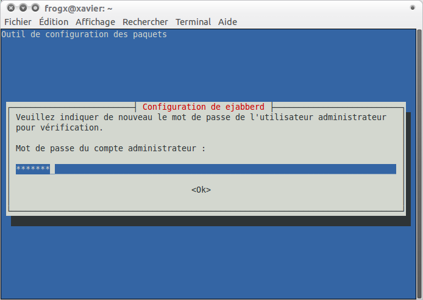

infra:archipel:ejabberd:004.png
===============================

004.png

← Retour à [Installation de archipel sous ubuntu
10.10](../../../../infra/archipel.html "infra:archipel")

Date:
:   2013/03/29 09:42
Nom de fichier:
:   004.png
Format:
:   PNG
Taille:
:   24KB
Largeur:
:   694
Hauteur:
:   492

