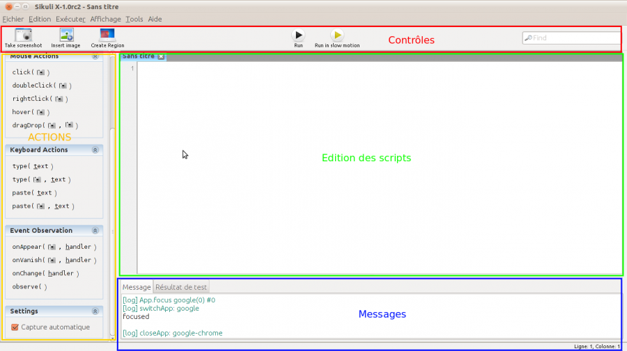

infra:sikuli:interface.png
==========================

interface.png

← Retour à [Installation de sikuli IDE sous Ubuntu
10.10](../../../infra/sikuli.html "infra:sikuli")

Date:
:   2013/03/29 09:42
Nom de fichier:
:   interface.png
Format:
:   PNG
Taille:
:   77KB
Largeur:
:   1366
Hauteur:
:   767

