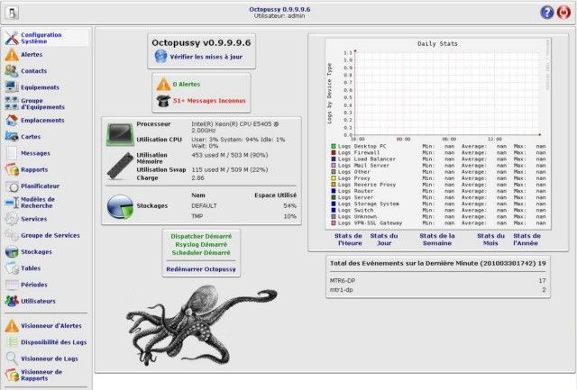

integration:octo\_accueil.jpg
=============================

octo\_accueil.jpg

← Retour à
[Octopussy](../../nagios/integration/8pussy.html "nagios:integration:8pussy")

Date:
:   2013/03/29 09:42
Nom de fichier:
:   octo\_accueil.jpg
Format:
:   JPEG
Taille:
:   65KB
Largeur:
:   640
Hauteur:
:   433

