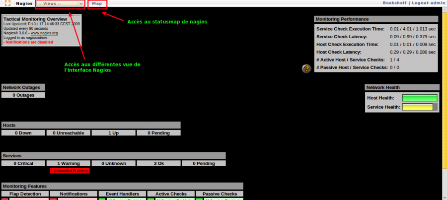

nagios:gw-nagios.png
====================

gw-nagios.png

← Retour à [Installation GroundWork sur Ubuntu 8.0.4
LTS](../../groundwork/groundwork-ubuntu-install.html "groundwork:groundwork-ubuntu-install")

Date:
:   2013/03/29 09:42
Nom de fichier:
:   gw-nagios.png
Format:
:   PNG
Taille:
:   89KB
Largeur:
:   1277
Hauteur:
:   573

