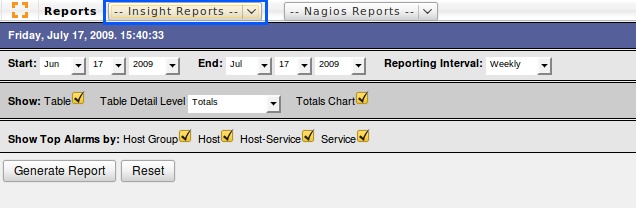

nagios:gw-reports1.png
======================

gw-reports1.png

← Retour à [Installation GroundWork sur Ubuntu 8.0.4
LTS](../../groundwork/groundwork-ubuntu-install.html "groundwork:groundwork-ubuntu-install")

Date:
:   2013/03/29 09:42
Nom de fichier:
:   gw-reports1.png
Format:
:   PNG
Taille:
:   22KB
Largeur:
:   636
Hauteur:
:   208

