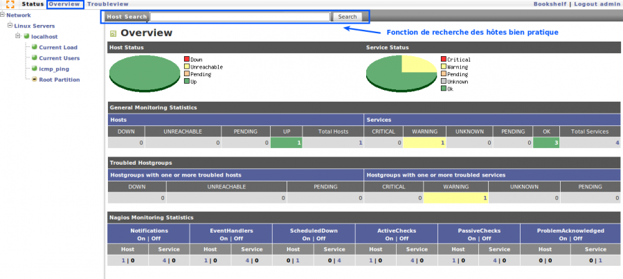

nagios:gw-status1.png
=====================

gw-status1.png

← Retour à [Installation GroundWork sur Ubuntu 8.0.4
LTS](../../groundwork/groundwork-ubuntu-install.html "groundwork:groundwork-ubuntu-install")

Date:
:   2013/03/29 09:42
Nom de fichier:
:   gw-status1.png
Format:
:   PNG
Taille:
:   58KB
Largeur:
:   1276
Hauteur:
:   572

