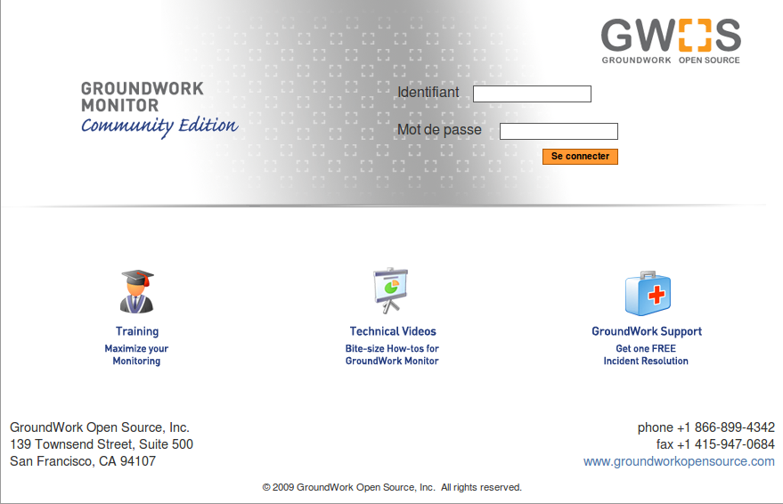

nagios:gwms-6.0\_login.png
==========================

gwms-6.0\_login.png

← Retour à [Installation de Groundwork Bêta 6.0 sur Ubuntu 8.0.4
LTS](../../groundwork/groundwork6.0-install-ubuntu.html "groundwork:groundwork6.0-install-ubuntu")

Date:
:   2013/03/29 09:42
Nom de fichier:
:   gwms-6.0\_login.png
Format:
:   PNG
Taille:
:   132KB
Largeur:
:   879
Hauteur:
:   566

