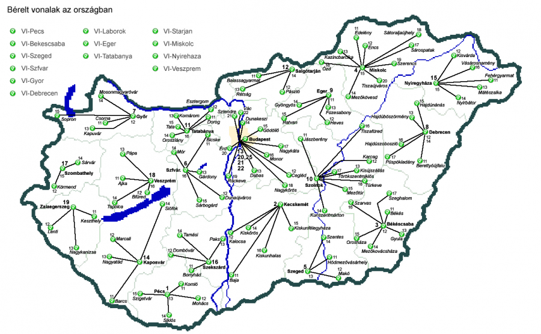

nagios:infra-complete:nagvis\_map\_2.png
========================================

nagvis\_map\_2.png

← Retour à [Nagios complet avec NDOUtils et
Nagvis](../../../nagios/mise-en-place-complete-nagios-sur-rhel-5.4/nagios-infrastructure-complete.html "nagios:mise-en-place-complete-nagios-sur-rhel-5.4:nagios-infrastructure-complete")

Date:
:   2013/03/29 09:42
Nom de fichier:
:   nagvis\_map\_2.png
Format:
:   PNG
Taille:
:   364KB
Largeur:
:   1214
Hauteur:
:   750

