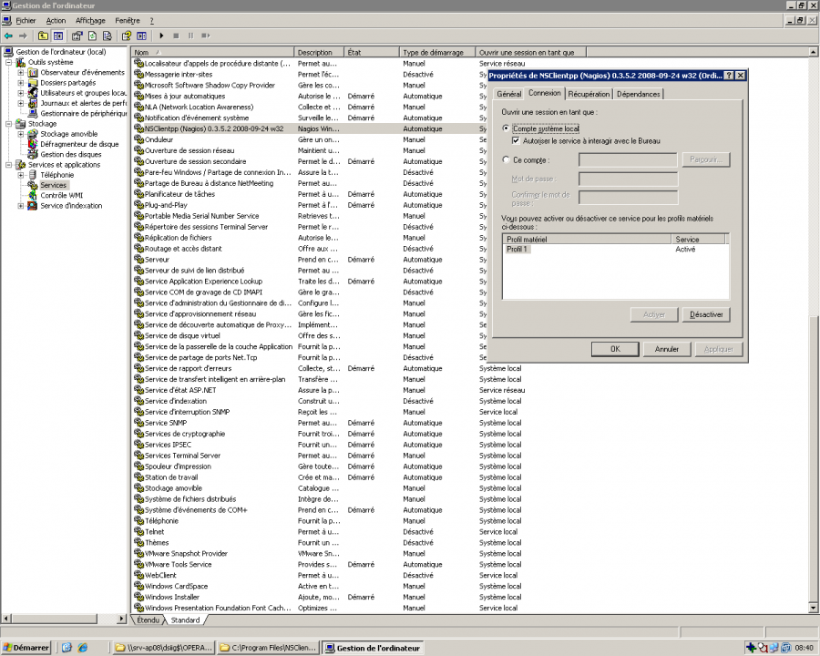

nagios:infra-complete:nscclientpp.png
=====================================

nscclientpp.png

← Retour à [Supervision Nagios
Agent](../../../nagios/mise-en-place-complete-nagios-sur-rhel-5.4/supervision-nagios-agent.html "nagios:mise-en-place-complete-nagios-sur-rhel-5.4:supervision-nagios-agent")

Date:
:   2013/03/29 09:42
Nom de fichier:
:   nscclientpp.png
Format:
:   PNG
Taille:
:   101KB
Largeur:
:   1280
Hauteur:
:   1024

