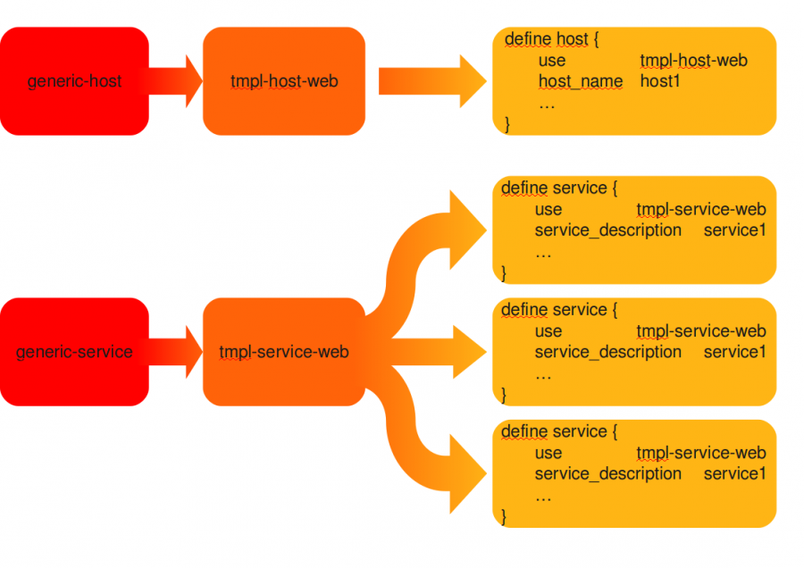

nagios:nagios-debutant:heritage\_template.png
=============================================

heritage\_template.png

← Retour à [Les templates et les "pivots" de
configuration](../../../nagios/nagios-debutant/templates-hostgroups-pivots.html "nagios:nagios-debutant:templates-hostgroups-pivots")

Date:
:   2013/03/29 09:42
Nom de fichier:
:   heritage\_template.png
Format:
:   PNG
Taille:
:   109KB
Largeur:
:   1123
Hauteur:
:   794

