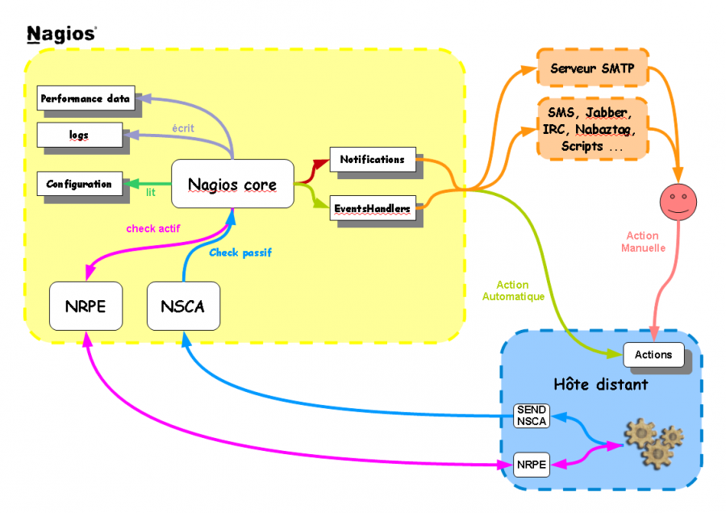

nagios:nagios-debutant:principe\_fonctionnement\_nagios.png
===========================================================

principe\_fonctionnement\_nagios.png

← Retour à [NAGIOS - Guide de démarrage pour
débutant](../../../nagios/nagios-debutant/start.html "nagios:nagios-debutant:start")

Date:
:   2013/03/29 09:42
Nom de fichier:
:   principe\_fonctionnement\_nagios.png
Format:
:   PNG
Taille:
:   123KB
Largeur:
:   1123
Hauteur:
:   794

