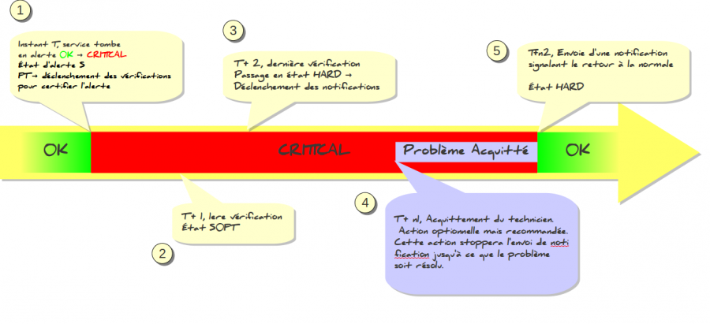

nagios:nagios-debutant:principe\_notification.png
=================================================

principe\_notification.png

← Retour à [Ce qu'il faut savoir sur
Nagios](../../../nagios/nagios-debutant/ce-qu-il-faut-savoir.html "nagios:nagios-debutant:ce-qu-il-faut-savoir")

Date:
:   2013/03/29 09:42
Nom de fichier:
:   principe\_notification.png
Format:
:   PNG
Taille:
:   141KB
Largeur:
:   1323
Hauteur:
:   605

