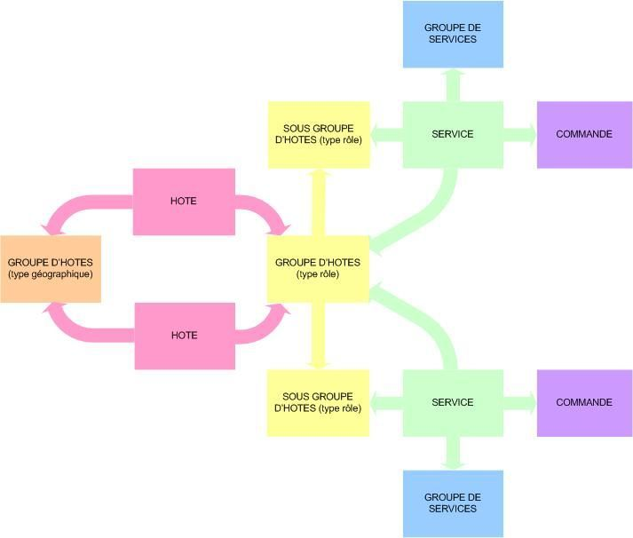

nagios:nagios-debutant:principes\_pivots\_conf.jpg
==================================================

principes\_pivots\_conf.jpg

← Retour à [Les templates et les "pivots" de
configuration](../../../nagios/nagios-debutant/templates-hostgroups-pivots.html "nagios:nagios-debutant:templates-hostgroups-pivots")

Date:
:   2013/03/29 09:42
Nom de fichier:
:   principes\_pivots\_conf.jpg
Format:
:   JPEG
Taille:
:   25KB
Largeur:
:   713
Hauteur:
:   606

