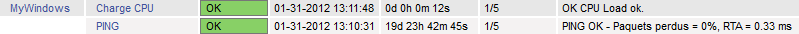

nagios:nsclient-checknrpe-aliascpu.png
======================================

nsclient-checknrpe-aliascpu.png

← Retour à [Superviser un hôte Windows avec
NSClient++](../../nagios/nagios-nsclient-host.html "nagios:nagios-nsclient-host")

Date:
:   2013/03/29 09:42
Nom de fichier:
:   nsclient-checknrpe-aliascpu.png
Format:
:   PNG
Taille:
:   6KB
Largeur:
:   799
Hauteur:
:   34

