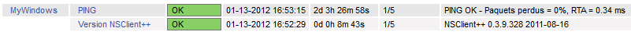

nagios:nsclient-checknt-clientversion.png
=========================================

nsclient-checknt-clientversion.png

← Retour à [Superviser un hôte Windows avec
NSClient++](../../nagios/nagios-nsclient-host.html "nagios:nagios-nsclient-host")

Date:
:   2013/03/29 09:42
Nom de fichier:
:   nsclient-checknt-clientversion.png
Format:
:   PNG
Taille:
:   7KB
Largeur:
:   801
Hauteur:
:   41

