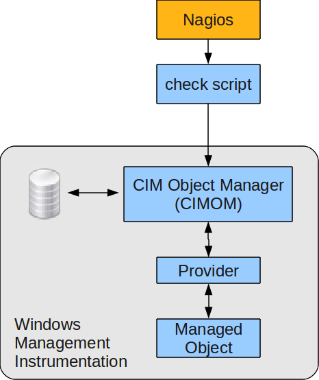

nagios:windows-client:nagios\_wmi.png
=====================================

nagios\_wmi.png

← Retour à [Supervision
WMI](../../../nagios/windows-client/superivision-wmi.html "nagios:windows-client:superivision-wmi")

Date:
:   2013/03/29 09:42
Nom de fichier:
:   nagios\_wmi.png
Format:
:   PNG
Taille:
:   53KB
Largeur:
:   466
Hauteur:
:   554

