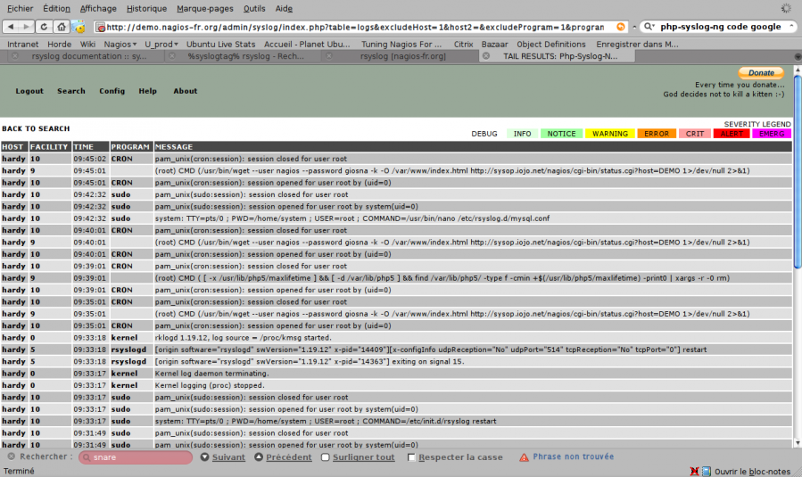

php-syslog-ng.png
=================

php-syslog-ng.png

← Retour à
[Rsyslog](../nagios/integration/rsyslog.html "nagios:integration:rsyslog")

Date:
:   2013/03/29 09:42
Nom de fichier:
:   php-syslog-ng.png
Format:
:   PNG
Taille:
:   193KB
Largeur:
:   1278
Hauteur:
:   760

