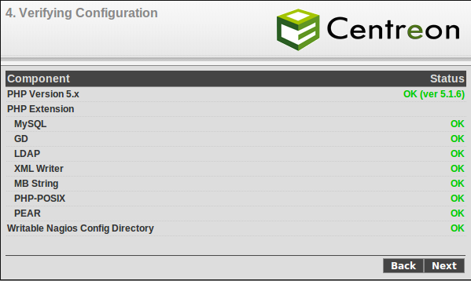

powered:centreon:centreon\_php\_verif.png
=========================================

centreon\_php\_verif.png

← Retour à [Installation de Centreon 2.1 sur CentOS
5.3](../../../centreon/centreon-centos-install.html "centreon:centreon-centos-install")

Date:
:   2013/03/29 09:42
Nom de fichier:
:   centreon\_php\_verif.png
Format:
:   PNG
Taille:
:   32KB
Largeur:
:   599
Hauteur:
:   358

