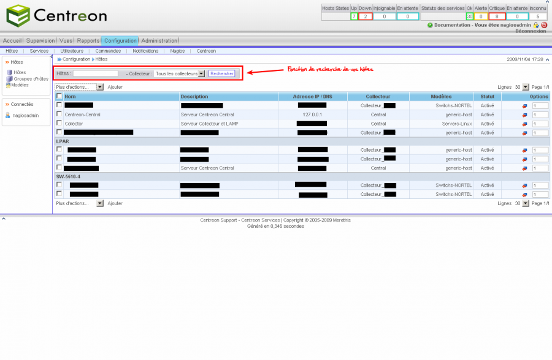

powered:centreon:manuel-utilisation:centreon\_conf\_hote.png
============================================================

centreon\_conf\_hote.png

← Retour à [Manuel d'utilisation
Centreon](../../../../centreon/manuel-utilisation/start.html "centreon:manuel-utilisation:start")

Date:
:   2013/03/29 09:42
Nom de fichier:
:   centreon\_conf\_hote.png
Format:
:   PNG
Taille:
:   47KB
Largeur:
:   1280
Hauteur:
:   837

