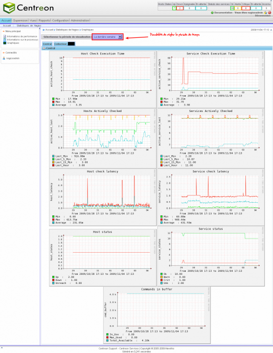

powered:centreon:manuel-utilisation:centreon\_perf\_graph\_poller.png
=====================================================================

centreon\_perf\_graph\_poller.png

← Retour à [Manuel d'utilisation
Centreon](../../../../centreon/manuel-utilisation/start.html "centreon:manuel-utilisation:start")

Date:
:   2013/03/29 09:42
Nom de fichier:
:   centreon\_perf\_graph\_poller.png
Format:
:   PNG
Taille:
:   217KB
Largeur:
:   1264
Hauteur:
:   1630

