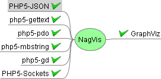

powered:centreon:nagvis.png
===========================

nagvis.png

← Retour à [Installation NagVis sur SLES
10](../../../nagios/addons/nagvis/nagvis-suse-install.html "nagios:addons:nagvis:nagvis-suse-install")

Date:
:   2013/03/29 09:42
Nom de fichier:
:   nagvis.png
Format:
:   PNG
Taille:
:   5KB
Largeur:
:   272
Hauteur:
:   135

