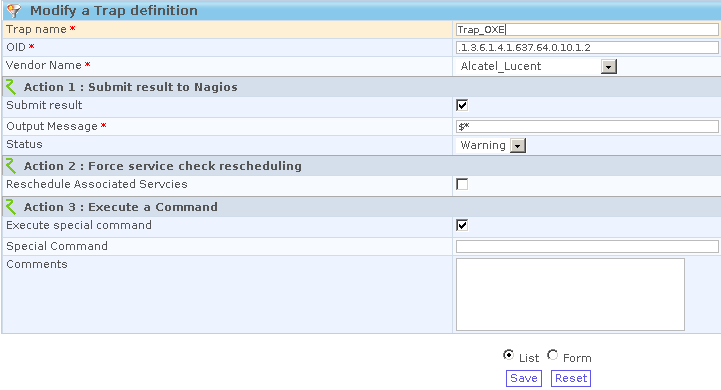

powered:centreon:tutooxe-013.png
================================

tutooxe-013.png

← Retour à [Superviser un Autocom OXE V9.x Alcatel-Lucent sous
Centreon/Nagios](../../../centreon/superviser-oxe-alcatel.html "centreon:superviser-oxe-alcatel")

Date:
:   2013/03/29 09:42
Nom de fichier:
:   tutooxe-013.png
Format:
:   PNG
Taille:
:   15KB
Largeur:
:   721
Hauteur:
:   390

