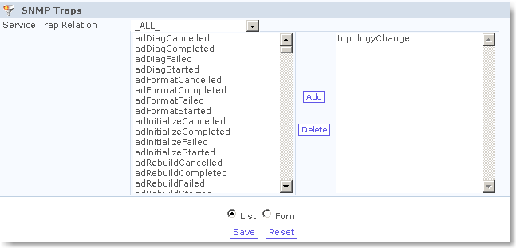

powered:centreon:tutostpcentreon-001.png
========================================

tutostpcentreon-001.png

← Retour à [Superviser le spanning-tree sous
Centreon/Nagios](../../../centreon/superviser-spanning-tree.html "centreon:superviser-spanning-tree")

Date:
:   2013/03/29 09:42
Nom de fichier:
:   tutostpcentreon-001.png
Format:
:   PNG
Taille:
:   16KB
Largeur:
:   647
Hauteur:
:   311

