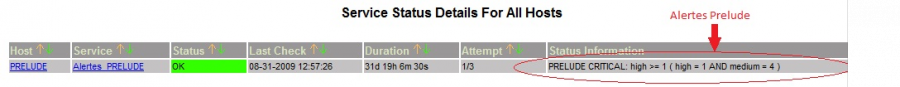

securite:nagios\_alertes\_prelude.png
=====================================

nagios\_alertes\_prelude.png

← Retour à [Architecture d'une solution Sécurité
OSS](../../securite/architecture-oss/start.html "securite:architecture-oss:start")

Date:
:   2013/03/29 09:42
Nom de fichier:
:   nagios\_alertes\_prelude.png
Format:
:   PNG
Taille:
:   93KB
Largeur:
:   1088
Hauteur:
:   106

