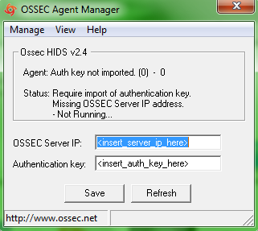

securite:ossec:ossec\_agent\_win32.png
======================================

ossec\_agent\_win32.png

← Retour à [Installation d'Ossec sur
Ubuntu](../../../securite/ossec/ossec-ubuntu-install.html "securite:ossec:ossec-ubuntu-install")

Date:
:   2013/03/29 09:42
Nom de fichier:
:   ossec\_agent\_win32.png
Format:
:   PNG
Taille:
:   33KB
Largeur:
:   321
Hauteur:
:   287

