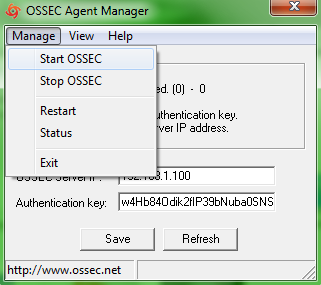

securite:ossec:ossec\_agent\_win32\_manage.png
==============================================

ossec\_agent\_win32\_manage.png

← Retour à [Prise en main
d'Ossec](../../../securite/ossec/ossec-use.html "securite:ossec:ossec-use")

Date:
:   2013/03/29 09:42
Nom de fichier:
:   ossec\_agent\_win32\_manage.png
Format:
:   PNG
Taille:
:   30KB
Largeur:
:   321
Hauteur:
:   285

