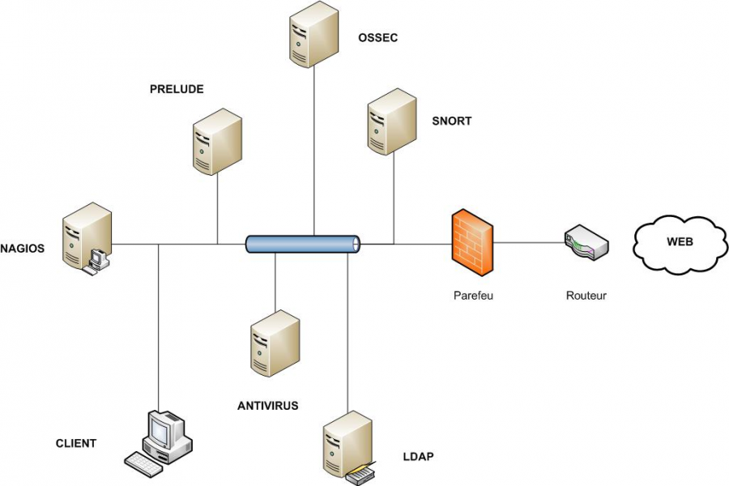

securite:topo\_physique.png
===========================

topo\_physique.png

← Retour à [Architecture d'une solution Sécurité
OSS](../../securite/architecture-oss/start.html "securite:architecture-oss:start")

Date:
:   2013/03/29 09:42
Nom de fichier:
:   topo\_physique.png
Format:
:   PNG
Taille:
:   168KB
Largeur:
:   1025
Hauteur:
:   684

