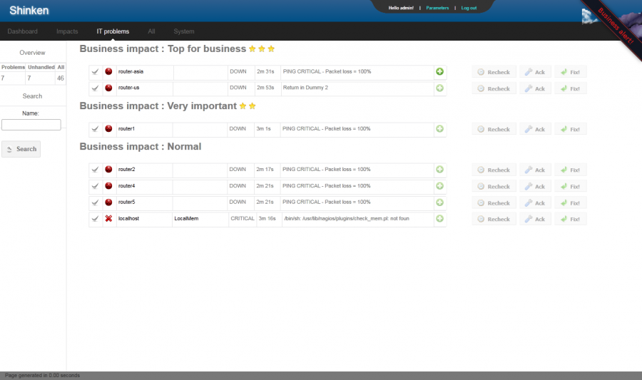

shinken:problems.png
====================

problems.png

← Retour à [Interface
Shinken](../../shinken/shinken-use-ui.html "shinken:shinken-use-ui")

Date:
:   2013/03/29 09:42
Nom de fichier:
:   problems.png
Format:
:   PNG
Taille:
:   78KB
Largeur:
:   1359
Hauteur:
:   806

