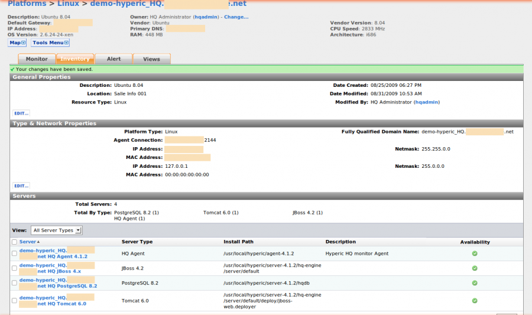

supervision:hyperic-ressource\_inventory.png
============================================

hyperic-ressource\_inventory.png

← Retour à [Installation de Hyperic HQ sur Ubuntu 8.0.4
LTS](../../various/hyperic-ubuntu-install.html "various:hyperic-ubuntu-install")

Date:
:   2013/03/29 09:42
Nom de fichier:
:   hyperic-ressource\_inventory.png
Format:
:   PNG
Taille:
:   126KB
Largeur:
:   1263
Hauteur:
:   748

