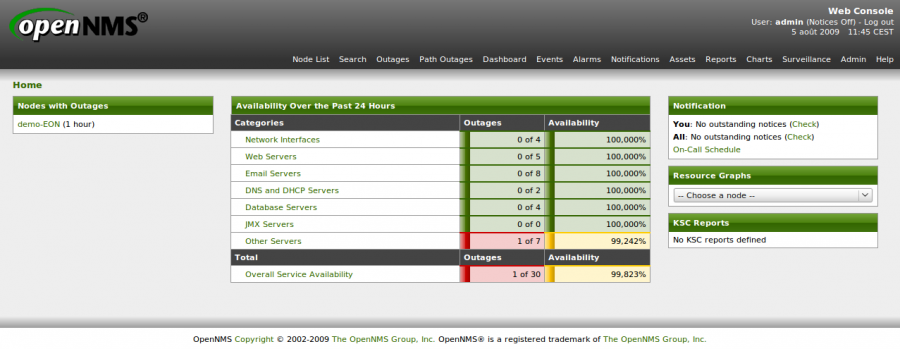

supervision:opennms-accueil.png
===============================

opennms-accueil.png

← Retour à [Installation d'OpenNMS sur Ubuntu 8.0.4
LTS](../../opennms/install-on-ubuntu.html "opennms:install-on-ubuntu")

Date:
:   2013/03/29 09:42
Nom de fichier:
:   opennms-accueil.png
Format:
:   PNG
Taille:
:   69KB
Largeur:
:   1277
Hauteur:
:   496

