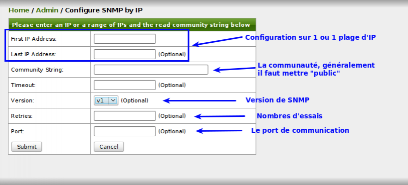

supervision:opennms-admin\_config\_snmp\_ip.png
===============================================

opennms-admin\_config\_snmp\_ip.png

← Retour à [Installation d'OpenNMS sur Ubuntu 8.0.4
LTS](../../opennms/install-on-ubuntu.html "opennms:install-on-ubuntu")

Date:
:   2013/03/29 09:42
Nom de fichier:
:   opennms-admin\_config\_snmp\_ip.png
Format:
:   PNG
Taille:
:   38KB
Largeur:
:   818
Hauteur:
:   372

