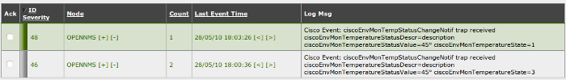

supervision:opennms:exemple-varbinds-05.png
===========================================

exemple-varbinds-05.png

← Retour à [Configuration des évènements et des
alarmes](../../../opennms/events-alarms.html "opennms:events-alarms")

Date:
:   2013/03/29 09:42
Nom de fichier:
:   exemple-varbinds-05.png
Format:
:   PNG
Taille:
:   41KB
Largeur:
:   700
Hauteur:
:   99

