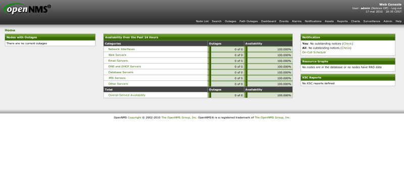

supervision:opennms:homepage-01.png
===================================

homepage-01.png

← Retour à [Installation d'OpenNMS sur CentOS
5.x](../../../opennms/install-on-centos.html "opennms:install-on-centos")

Date:
:   2013/03/29 09:42
Nom de fichier:
:   homepage-01.png
Format:
:   PNG
Taille:
:   63KB
Largeur:
:   800
Hauteur:
:   360

