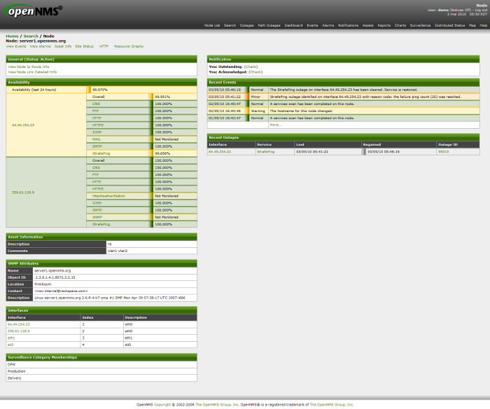

supervision:opennms:nodedetail-01.png
=====================================

nodedetail-01.png

← Retour à [Interface Web
d'OpenNMS](../../../opennms/opennms-interface.html "opennms:opennms-interface")

Date:
:   2013/03/29 09:42
Nom de fichier:
:   nodedetail-01.png
Format:
:   PNG
Taille:
:   98KB
Largeur:
:   700
Hauteur:
:   584

