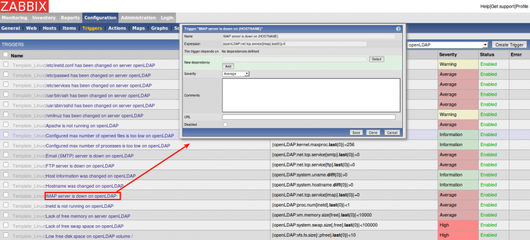

supervision:zabbix-config\_triggers.png
=======================================

zabbix-config\_triggers.png

← Retour à [Installation Zabbix 1.4.2 sur Ubuntu
8.04](../../zabbix/zabbix-ubuntu-install-old.html "zabbix:zabbix-ubuntu-install-old")

Date:
:   2013/03/29 09:42
Nom de fichier:
:   zabbix-config\_triggers.png
Format:
:   PNG
Taille:
:   202KB
Largeur:
:   1262
Hauteur:
:   574

